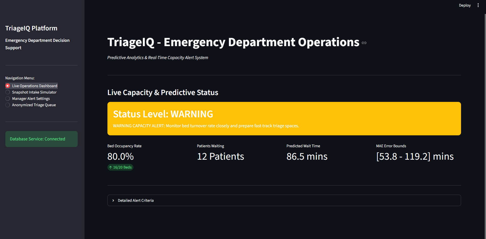
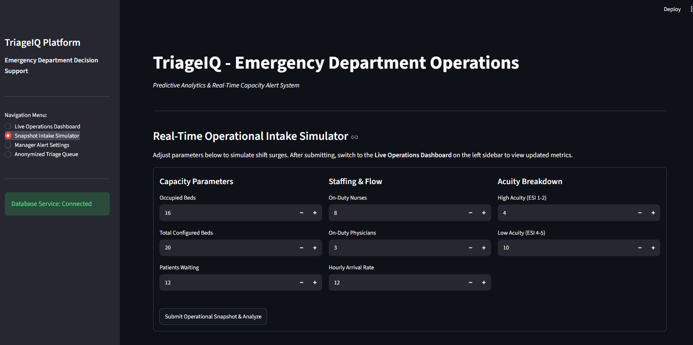
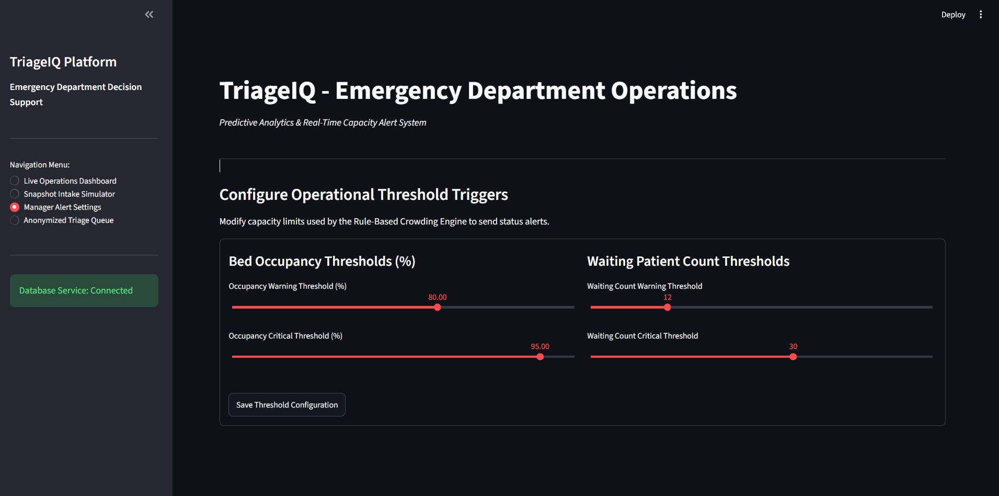
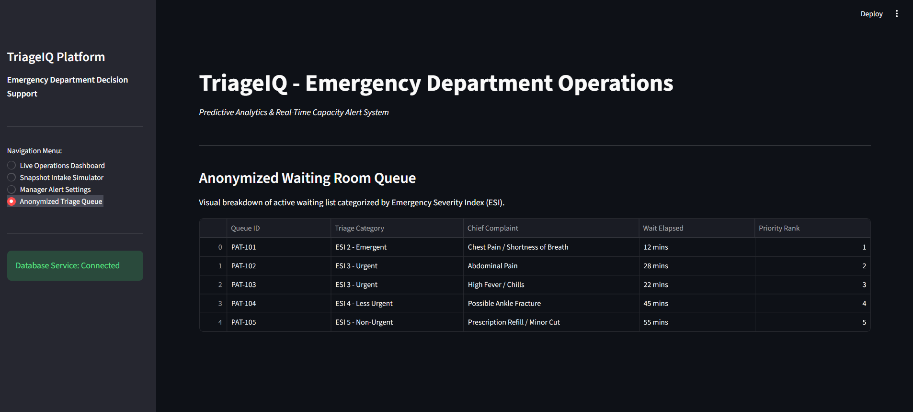

# 🏥 TriageIQ

## Machine Learning-Powered Emergency Department Decision Support System

> **Computer Science Capstone Project**  
> **Author:** Kayla Noble

---

## Overview

TriageIQ is a healthcare informatics dashboard that predicts Emergency Department wait times using machine learning while providing hospital managers with real-time operational awareness. The application combines historical CDC NHAMCS emergency department data with live operational inputs to estimate patient wait times, evaluate department crowding, and present operational metrics through an interactive Streamlit dashboard.

---

# Features

- Random Forest Regression wait time prediction
- Streamlit multi-page dashboard
- SQLite operational database
- CDC NHAMCS preprocessing pipeline
- Rule-based crowding engine
- Manager alert thresholds
- Operational snapshot simulator
- Historical prediction logging
- Plotly interactive visualizations

---

# Screenshots

## Live Operations Dashboard



## Snapshot Intake Simulator



## Manager Alert Settings



## Anonymized Triage Queue



---

# Technology Stack

- Python
- Streamlit
- Scikit-Learn
- SQLite
- Pandas
- NumPy
- Plotly
- Git
- GitHub

---

# Machine Learning Pipeline

CDC NHAMCS Dataset

→ Data Cleaning

→ Feature Engineering

→ Random Forest Regression

→ Model Evaluation

→ Serialized Model (.joblib)

→ Real-Time Prediction

---

# Project Structure

```text
TriageIQ/
├── app.py
├── core_data/
├── model_artifacts/
├── services/
├── testing_suite/
├── images/
├── requirements.txt
└── README.md
```

---

# Installation

```bash
git clone https://github.com/KaylaNoble/TriageIQ.git
cd TriageIQ
pip install -r requirements.txt
python fix_app.py
streamlit run app.py
```

---

# Sprint Progress

## Sprint 1
- SQLite database
- ETL pipeline
- CDC preprocessing

## Sprint 2
- Machine learning model
- Prediction service
- Model serialization

## Sprint 3
- Live dashboard
- Snapshot simulator
- Manager settings
- Alert engine
- Dashboard integration

---

# Skills Demonstrated

- Healthcare Informatics
- Machine Learning
- Predictive Analytics
- Data Engineering
- Database Design
- Dashboard Development
- Agile Development
- Git Version Control

---

# Future Enhancements

- HL7/FHIR Integration
- Multi-hospital support
- Executive analytics
- Staffing optimization

---

# Author

**Kayla Noble**

Computer Science — Maryville University

GitHub: https://github.com/KaylaNoble
